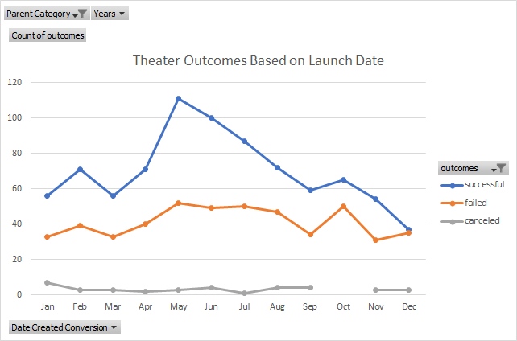
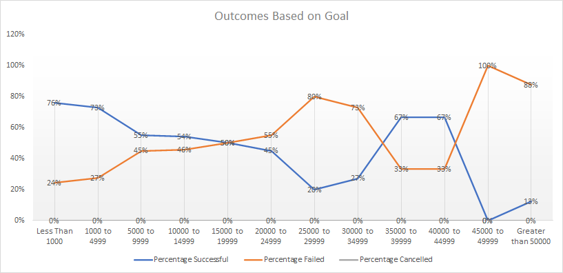

# Kickstarting with Excel
## Overview of Project
The project examines the results of Kickstarter campaigns in the 'Theater' category of the provided Kickstarter Dataset. 
### Purpose
The project aims to examine the results of funding campaigns for subcategory of 'plays' based on their launch date and funding goals. 
## Analysis and Challenges
### Analysis of Outcomes Based on Launch Date
The line chart below demonstrates the outcomes of theater campaigns based on their Launch Date. The comparison of 'successful', 'failed', and 'cancelled' outcomes in the category are demonstrated against the X axis, which groups the campaigns from 2009-2017 based on month, and the Y axis that provides the number of campaigns. The graph demonstrates that May, June, and July launches were most successful with 111, 100, and 87 successful campaigns launched in each month respectively. Given that May, June, and July saw the launch of most Theater campaigns in total (166, 153, 138 campaigns were launched respectively), the number of failed campaigns are also higher than in other months: 52, 49, and 50 failed campaigns respectively. Effectively, 67% of campaigns launched in May were successful, 65% in June, and 63% were successful in July. It is worth noting that most of the months have relatively similar success rates except for December, where only 49% of the launched campaigns were successful, marking the lowest success rate in the Theater category of the Kickstarter Dataset.

### Analysis of Outcomes Based on Goals
The line chart below demonstrates outcomes of subcategory ‘plays’ in the ‘theater’ category. The graph compares successful, failed, and cancelled funding campaigns for plays based on their target goal. The highest success rate is observed for campaigns with funding goals of up to $4999: 76% of campaigns with less than $1000 funding goal and 73% of campaigns with funding goals between $1000 and $4999 were successful. 

### Challenges and Difficulties Encountered
No challenges and difficulties were encountered in the analysis of the dataset or visualization of the results. A possible difficulty might emerge if one were to examine whether there is a relationship between the variables studied in this project: launch date and goals. It may be necessary to further understand whether the results based on goal were in any way dependent on the launch date of the campaign.

## Results
- Drawing from the analysis of the results based on launch date, it is advised to start the campaign come summer. The analysis shows that the success rate of theater campaigns starts increasing in April and has relatively high success rates in May (67%), June (65%), and July (63%). Louise may have a higher chance of success if she starts her campaign in May. It must be noted, however, that summer sees an increase in the total number of campaigns launched, so Louise might benefit from further parsing of the data of successful and failed campaigns in her category to understand the probability of her success. For example, data could be further parsed based on genre. 

- Drawing from the analysis of the results based on goals, it is advised to set the target goal to no more than $5000. The results demonstrate that 75% of campaigns with goals under $1000 and 73% of campaigns with goals under $5000 were successful. 

- One of the limitations of the dataset comes from the need to parse the data on plays into genre. Perhaps, a further look into the success rates based on genre might help Louise understand the trends in her category of campaigns. Our analysis of results based on Launch date demonstrates relatively similar success rates. For example, February, April, and July share the same rates of success at 63% of the campaigns launched in those months; March, September, and November all have a 61% success rate. It may be worthwhile to investigate whether success rates based on Launch Date depend on the genre. 

- The analysis could benefit from a scatter plot of the relationship between Goals as dependent variable and Launch Date as the independent variable to understand whether there is a correlation between the two to provide Louise with a more detailed picture of the trends and dynamics of Kickstarter campaigns in her category. 

